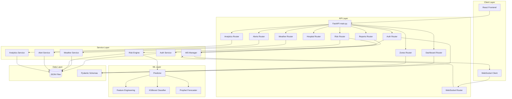

# 🦟 EPISENCE — Backend Architecture Implementation Plan

## Overview

Build the complete FastAPI backend for the EPISENCE Predictive Epidemiological Intelligence System. This covers all 7 database entities, JWT auth, WebSocket real-time updates, ML pipeline integration, and seed data — structured for a 24-hour hackathon sprint.

---

## Proposed Changes

### 1. Project Foundation & Configuration

#### [NEW] `backend/app/__init__.py`
Empty init file to make `app` a Python package.

#### [NEW] `backend/app/config.py`
- Pydantic `Settings` class with environment variable loading
- Keys: `SECRET_KEY`, `ALGORITHM=HS256`, `ACCESS_TOKEN_EXPIRE_MINUTES=480`
- Database URL: `sqlite:///./episence.db`
- OpenWeatherMap API key placeholder
- CORS origins list

#### [NEW] `backend/app/json_db.py`
- Utility class to read/write JSON files in `backend/data/`
- Functions: `read_json(filename)`, `write_json(filename, data)`
- Includes thread-safe locking for file operations

#### [NEW] `backend/requirements.txt`
```
fastapi==0.111.0
uvicorn[standard]==0.30.1
sqlalchemy==2.0.30
python-jose[cryptography]==3.3.0
passlib[bcrypt]==1.7.4
python-multipart==0.0.9
pydantic[dotenv]==2.7.4
pydantic-settings==2.3.4
httpx==0.27.0
scikit-learn==1.5.0
xgboost==2.0.3
prophet==1.1.5
joblib==1.4.2
python-dotenv==1.0.1
```

#### [NEW] `backend/.env.example`
```
SECRET_KEY=your-secret-key-here
OPENWEATHERMAP_API_KEY=your-key-here
```

---

### 2. Data Models (JSON Storage)

All entities are stored as lists of dictionaries in `backend/data/*.json`. We use Pydantic models for request/response validation instead of SQLAlchemy models.

#### JSON Files:
- `data/users.json`
- `data/zones.json`
- `data/weather_data.json`
- `data/water_reports.json`
- `data/hospital_cases.json`
- `data/risk_scores.json`
- `data/alerts.json`

---

### 3. Pydantic Schemas (Request/Response Validation)

#### [NEW] `backend/app/schemas/auth.py`
- `UserRegister`: email, password, full_name, role (optional)
- `UserLogin`: email, password
- `UserResponse`: id, email, full_name, role, is_active, created_at
- `TokenResponse`: access_token, token_type, user (UserResponse)

#### [NEW] `backend/app/schemas/zone.py`
- `ZoneCreate`: name, latitude, longitude, radius_km, city, state
- `ZoneResponse`: all fields + relationships count
- `ZoneListResponse`: list of ZoneResponse

#### [NEW] `backend/app/schemas/weather.py`
- `WeatherResponse`: all fields
- `WeatherFetchRequest`: zone_id

#### [NEW] `backend/app/schemas/water_report.py`
- `ReportCreate`: zone_id, latitude, longitude, description, severity, reporter_name, photo_url?
- `ReportUpdate`: status
- `ReportResponse`: all fields

#### [NEW] `backend/app/schemas/hospital_case.py`
- `CaseCreate`: zone_id, date, disease_type, case_count, hospital_name, severity_breakdown
- `CaseResponse`: all fields

#### [NEW] `backend/app/schemas/risk_score.py`
- `RiskScoreResponse`: all fields including ml_prediction
- `RiskComputeResponse`: zone_id, composite_score, risk_level, factors

#### [NEW] `backend/app/schemas/alert.py`
- `AlertResponse`: all fields
- `AlertHistoryResponse`: list with pagination

---

### 4. Authentication Service

#### [NEW] `backend/app/services/auth_service.py`
```
Core Functions:
├── hash_password(password) → bcrypt hash
├── verify_password(plain, hashed) → bool
├── create_access_token(data, expires_delta) → JWT string
├── decode_token(token) → payload dict
├── get_current_user(token, db) → User (FastAPI dependency)
├── require_role(*roles) → dependency that checks user.role
└── get_optional_user(token?, db) → User | None (for public+auth endpoints)
```
- JWT payload: `{"sub": user_id, "role": role, "exp": expiry}`
- Token extracted from `Authorization: Bearer <token>` header
- Role hierarchy: `admin > health_officer > citizen > guest`

---

### 5. Service Layer (Business Logic)

#### [NEW] `backend/app/services/weather_service.py`
- `fetch_weather(zone_id, db)`: Call OpenWeatherMap API → store in DB
- `get_zone_weather(zone_id, db, days=30)`: Query historical weather
- Fallback: return seed data if API key not configured

#### [NEW] `backend/app/services/risk_engine.py`
```
Rule-Based Engine:
├── compute_weather_score(weather_data) → 0-100
│   ├── Temperature 25-35°C → higher score
│   ├── Humidity > 60% → higher score
│   └── Rainfall > 50mm → higher score
├── compute_water_score(reports_14d) → 0-100
│   ├── Count × severity weighting
│   └── Recency decay factor
├── compute_hospital_score(cases_7d) → 0-100
│   ├── Case count trend (slope)
│   ├── Disease diversity multiplier
│   └── Severity breakdown weighting
├── compute_composite(w, wa, h) → weighted sum
│   └── 0.30 × weather + 0.25 × water + 0.45 × hospital
└── classify_risk(score) → RiskLevel enum
    └── 0-25: low | 26-50: moderate | 51-75: high | 76-100: critical
```

#### [NEW] `backend/app/services/alert_service.py`
- `check_and_create_alerts(zone_id, risk_score, db)`: Auto-generate alerts on threshold crossings
- `resolve_alert(alert_id, db)`: Mark resolved + set timestamp
- `get_active_alerts(db)`: Query active alerts with zone info

#### [NEW] `backend/app/services/analytics_service.py`
- `get_correlation_data(zone_id, db)`: Weather vs cases correlation
- `get_predictions(zone_id, db)`: Load ML predictions from risk_scores

#### [NEW] `backend/app/services/ws_manager.py`
```python
class ConnectionManager:
    active_connections: dict[str, WebSocket]

    async connect(client_id, websocket)    # Accept + store
    async disconnect(client_id)            # Remove from pool
    async broadcast(message: dict)         # Send to ALL clients
    async send_to(client_id, message)      # Send to specific client
```
- Thread-safe connection tracking
- JSON serialization for all messages
- Auto-cleanup on disconnect

---

### 6. API Routes

#### [NEW] `backend/app/api/router.py`
- Master router aggregating all sub-routers with `/api/v1` prefix

#### [NEW] `backend/app/api/auth.py`
| Method | Path | Function |
|--------|------|----------|
| POST | `/auth/register` | Create user → return JWT |
| POST | `/auth/login` | Validate credentials → return JWT |
| GET | `/auth/me` | Return current user profile |

#### [NEW] `backend/app/api/dashboard.py`
| Method | Path | Auth | Function |
|--------|------|------|----------|
| GET | `/dashboard/summary` | Public | Aggregate stats: total zones, active alerts, avg risk, total cases |
| GET | `/dashboard/heatmap` | Public | Zone coordinates + risk levels for map rendering |

#### [NEW] `backend/app/api/zones.py`
| Method | Path | Auth |
|--------|------|------|
| GET | `/zones` | Public |
| GET | `/zones/{id}` | Public |
| POST | `/zones` | Admin only |

#### [NEW] `backend/app/api/weather.py`
| Method | Path | Auth |
|--------|------|------|
| GET | `/weather/{zone_id}` | Authenticated |
| POST | `/weather/fetch` | Officer+ |

#### [NEW] `backend/app/api/reports.py`
| Method | Path | Auth |
|--------|------|------|
| GET | `/reports` | Authenticated |
| POST | `/reports` | Citizen+ |
| PATCH | `/reports/{id}` | Officer+ |

- POST triggers WebSocket broadcast of `new_report` event

#### [NEW] `backend/app/api/hospital.py`
| Method | Path | Auth |
|--------|------|------|
| GET | `/hospital/cases` | Officer+ |
| POST | `/hospital/cases` | Officer+ |
| GET | `/hospital/trends/{zone_id}` | Officer+ |

#### [NEW] `backend/app/api/risk.py`
| Method | Path | Auth |
|--------|------|------|
| GET | `/risk/{zone_id}` | Officer+ |
| POST | `/risk/compute` | Officer+ |

- POST triggers risk engine → stores score → creates alerts → broadcasts `risk_updated`

#### [NEW] `backend/app/api/alerts.py`
| Method | Path | Auth |
|--------|------|------|
| GET | `/alerts` | Authenticated |
| GET | `/alerts/history` | Officer+ |

#### [NEW] `backend/app/api/analytics.py`
| Method | Path | Auth |
|--------|------|------|
| GET | `/analytics/correlation` | Officer+ |
| GET | `/analytics/predictions/{zone_id}` | Officer+ |
| POST | `/ml/retrain` | Admin only |

#### [NEW] `backend/app/api/websocket.py`
- `ws://host/api/v1/ws/{client_id}` — WebSocket endpoint
- On connect: add to ConnectionManager
- On disconnect: remove from pool
- Optional token validation via query param

---

### 7. ML Pipeline

#### [NEW] `backend/app/ml/feature_engineering.py`
```
extract_features(zone_id, date, db) → dict of 9 features:
  Weather: temperature_avg, humidity_avg, rainfall_mm, wind_speed
  Water:   active_water_reports_14d, avg_severity
  Hospital: case_count_7d, case_trend_slope, disease_diversity
```

#### [NEW] `backend/app/ml/train_classifier.py`
- Load seed data → feature engineering → train XGBoost
- 4-class classification: low, moderate, high, critical
- Save model to `backend/app/ml/trained_models/xgboost_risk.joblib`

#### [NEW] `backend/app/ml/train_forecaster.py`
- Per-zone Prophet model on composite_score time series
- 7 & 14-day forecast horizon
- Save models to `backend/app/ml/trained_models/prophet_{zone_id}.json`

#### [NEW] `backend/app/ml/predictor.py`
```
class RiskPredictor:
    classifier: XGBoost model (loaded at startup)
    forecasters: dict of Prophet models per zone

    predict_risk(features) → RiskLevel
    forecast_zone(zone_id, days=14) → {forecast_7d, forecast_14d, confidence}
```

#### [NEW] `backend/app/ml/trained_models/` (directory)
- Auto-populated after training script runs

---

### 8. Main Application Entry Point

#### [NEW] `backend/app/main.py`
```python
# FastAPI app initialization
app = FastAPI(title="EPISENCE API", version="1.0.0")

# CORS middleware (allow frontend origin)
# Include all API routers under /api/v1
# WebSocket endpoint registration

@app.on_event("startup"):
    # Create all DB tables
    # Load ML models into memory
    # Log startup info

@app.on_event("shutdown"):
    # Cleanup WebSocket connections
```

---

### 9. Seed Data

#### [NEW] `backend/app/seed/seed_zones.py`
- 15 Indian city zones (Delhi, Mumbai, Chennai, Kolkata, Bangalore, Hyderabad, Pune, Ahmedabad, Jaipur, Lucknow, Bhopal, Kochi, Guwahati, Patna, Coimbatore)
- Each with real lat/lng coordinates

#### [NEW] `backend/app/seed/seed_users.py`
- 3 demo users: admin@episence.gov.in, officer@episence.gov.in, citizen@episence.gov.in
- Pre-hashed passwords (all: `demo123`)

#### [NEW] `backend/app/seed/seed_weather.py`
- 90 days of synthetic weather per zone
- Realistic temperature/humidity/rainfall patterns by region

#### [NEW] `backend/app/seed/seed_hospital.py`
- 90 days of hospital case data per zone
- 4 disease types with realistic distributions

#### [NEW] `backend/app/seed/seed_reports.py`
- 50-100 water stagnation reports across zones
- Varying severities and statuses

#### [NEW] `backend/app/seed/seed_all.py`
- Master runner: zones → users → weather → hospital → reports → risk scores → alerts
- Idempotent (checks before inserting)

---

## Architecture Diagram



---

## Verification Plan

### Automated Tests
1. `python -m uvicorn app.main:app --reload` — server starts without errors
2. Test auth flow: register → login → access /auth/me with JWT
3. Test all CRUD endpoints via Swagger UI at `/docs`
4. Verify seed data populates all 7 tables
5. Verify WebSocket connection at `ws://localhost:8000/api/v1/ws/test`

### Manual Verification
- POST a water report → verify WebSocket broadcasts `new_report`
- POST `/risk/compute` → verify risk scores calculated and alerts created
- Check `/dashboard/summary` returns correct aggregated stats
- Verify role-based access: citizen cannot access `/risk/*` endpoints
