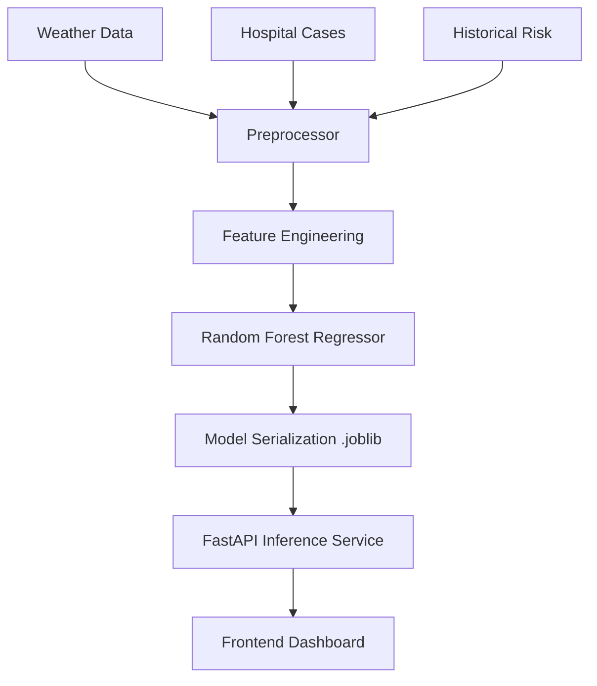

# ML Architecture: Epidemiological Risk Forecasting

This document outlines the machine learning architecture for the **EPISENCE** platform, focusing on the predictive engine that forecasts disease risk scores for various wards in the Pune region.

## 1. System Overview

The ML engine is designed to provide actionable insights for health officials by predicting the epidemiological risk 7 days into the future. It bridges the gap between historical weather patterns and future disease outbreaks.

## 2. Data Sources & Schema

The model consumes data from four primary JSON-based storage modules:

| Source | Frequency | Key Features used |
| :--- | :--- | :--- |
| **Weather Data** | Daily | Avg Temperature, Rainfall (mm), Humidity, Wind Speed |
| **Hospital Cases** | Real-time | Case counts per disease (Dengue, Malaria, etc.) |
| **Risk Scores** | Daily | Composite Risk Score (Target Variable) |
| **Zones** | Static | Geographical metadata (Radius, City, Ward Name) |

## 3. Feature Engineering

To capture the temporal nature of disease spread, we implement the following transformations:

### A. Rolling Averages (7-day window)
- `temp_rolling_7d`: Captures sustained heatwaves or temperature drops.
- `rain_rolling_7d`: Total precipitation over a week, critical for identifying vector breeding grounds (stagnant water).

### B. Lag Features
- `cases_lag_7d`: The case count from exactly one week ago. This captures the current momentum of an outbreak.

### C. Target Variable (Forward Shift)
- `target_risk_7d`: The model is trained to predict the `composite_score` exactly 7 days ahead of the current record's timestamp.

## 4. Model Architecture

### Algorithm: Random Forest Regressor
We selected Random Forest due to its:
1. **Non-linearity**: Ability to capture complex interactions between rainfall and temperature.
2. **Robustness**: Resistant to outliers in hospital reporting.
3. **Interpretability**: Provides feature importance scores to justify "Critical" alerts.

### Hyperparameters
| Parameter | Value | Rationale |
| :--- | :--- | :--- |
| `n_estimators` | 100 | Balance between accuracy and inference speed. |
| `max_depth` | 12 | Prevents overfitting on small historical datasets. |
| `random_state` | 42 | Ensures reproducible results across research and production. |
| `test_size` | 0.2 | Standard 80/20 split for validation. |

## 5. Implementation Pipeline

### Phase 1: Research (Jupyter)
Located in `backend/research/risk_prediction_model.ipynb`. This is used for EDA, hyperparameter tuning, and visualizing feature importance.

### Phase 2: Training (Automated)
Located in `backend/app/ml/train.py`. This script can be triggered as a cron job or during deployment to refresh the model with new data.

### Phase 3: Deployment (Inference)
The `PredictionService` (`backend/app/services/prediction_service.py`) loads the serialized model into memory and provides an API endpoint for real-time forecasting.

## 6. Feature Importance Matrix

Based on initial training, the primary drivers for the risk score are:
1. **Rain Rolling (7d)**: Highest impact due to mosquito breeding cycles.
2. **Cases Lag (7d)**: Second highest, representing baseline transmission.
3. **Temperature Avg**: Critical for viral replication rates in vectors.

## 7. Future Roadmap
- **Prophet Integration**: Adding Facebook Prophet for baseline seasonality (Monsoon cycles).
- **Ensemble Method**: Combining Random Forest with XGBoost for 14-day forecasts.
- **Geo-Spatial Features**: Adding ward-to-ward adjacency scores (infection spread from neighboring wards).
